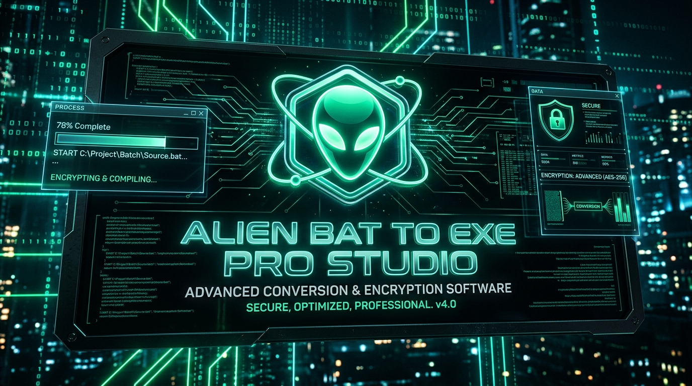

<div align="center">
  
</div>

# 👽 Alien BAT to EXE Converter Pro Studio v3.5

[](https://www.python.org/)
[](LICENSE)
[](https://github.com/alien-software-development/BatToExeConverterPro)
[](Release_Build/Installer/BatToExePro_Setup.exe)

> **Enterprise-grade Native Compiler & Armor Suite for Windows Batch (`.bat` / `.cmd`) & Shell (`.sh`) scripts into Windows `.exe` and macOS `.app` bundles.**  
> Developed with futuristic Alien obsidian cyberpunk aesthetics in CustomTkinter & Python, AES-256 dynamic encryption, in-memory execution, UAC / AppleScript privilege management, and standalone zero-dependency offline deployment.

---

## ⚡ Core Features

- 🍏 **Dual-Target Compilation (Windows `.exe` & macOS `.app`)**:
  - **Windows Target**: Compiles authentic Windows Portable Executable (PE) 32-bit (`x86`) and 64-bit (`x64`) binaries using native PE code synthesis and C# compiler integration.
  - **macOS Target**: Generates native macOS Application Bundles (`.app`) equipped with `Info.plist`, in-memory decrypted launcher, and ready-to-run `.zip` distribution archive.
  - **Multi-Script Support**: Seamlessly compile Windows Batch (`.bat`, `.cmd`) and Unix/macOS Shell (`.sh`, `.command`) scripts.
- 🔒 **Dynamic AES-256 Memory Encryption**: Protect batch and shell source code, passwords, database credentials, and internal API keys. Decryption occurs solely inside RAM—never writing unencrypted scripts to disk.
- 🛡 **Quantum Polymorphic Armor (Levels 1–4)**:
  - **Level 1 (Basic)**: Strips comments, redundant whitespaces, and normalizes execution.
  - **Level 2 (Advanced)**: Variable fragmentation, environment token slicing (`%var:~0,0%`), and randomized dead-code injection.
  - **Level 3 (Ultra Armor)**: Base64 tokenized memory decompression via PowerShell execution vector.
  - **Level 4 (Quantum Armor)**: Dynamic XOR byte ciphering with polymorphic decryption keys calculated at runtime.
- 🛡 **Privilege Elevation Controls**: Configure executables to enforce `requireAdministrator` (Windows UAC) or root elevation via native AppleScript prompts on macOS.
- 🎨 **12+ Cyber Preset Icons**: Choose from high-resolution application icons (Alien Cyber, Shield Security, Terminal Prompt, Setup Package, Database Server, Folder Sync, Lock Crypto, etc.) or load your own `.ico` / `.icns`.
- 📦 **Embedded Dependency Bundler**: Embed secondary files, DLLs, PowerShell/shell scripts, images, and config files into the executable container.
- 🖥 **Multiple Execution Modes**: Run in visible console mode, completely invisible background daemon mode (`winexe` / LSUIElement), minimized, or maximized.
- 🔑 **Cryptographic Machine Licensing**: Built-in hardware-bound key verification system with `AlienKeygen.exe` (Windows `MachineGuid` and macOS `IOPlatformUUID`).
- 📦 **Offline Setup Wizard (`BatToExePro_Setup.exe`)**:
  - Full administrator privilege detection and UAC elevation support.
  - Installs cleanly to `Program Files` or `%LocalAppData%`.
  - Integrates `"👽 Convert to EXE with BatToExe Pro"` directly into the Windows Explorer right-click context menu.
  - Creates Desktop and Start Menu program entries with a full uninstaller.

---

## 🏗 Solution Architecture

```
bat_to_exe/
├── core/                        # Core Python Engine Modules
│   ├── compiler.py             # AES-256 encryption, manifest injection & PE builder
│   ├── obfuscator.py           # Quantum Polymorphic XOR & fragmentation armor (L0-L4)
│   ├── license.py              # Hardware-locked licensing & trial enforcement
│   ├── shell.py                # Windows Explorer right-click context menu integration
│   └── templates.py            # Enterprise script templates library
├── ui/                          # Modern Cyberpunk CustomTkinter GUI
│   ├── theme.py                # Alien obsidian neon theme system
│   ├── main_window.py          # Studio main GUI with 7 modular tabs
│   ├── keygen_window.py        # Standalone Admin Keygen GUI
│   └── installer_window.py     # Offline Setup Wizard GUI with UAC elevation
├── Assets/                      # Icons, presets & branding graphics
│   ├── PresetIcons/            # 12 ready-to-use high-res .ico assets
│   ├── app_icon.ico            # Main application icon
│   ├── keygen_icon.ico         # Keygen tool icon
│   └── banner.png              # 16:9 Cyberpunk product banner
├── Release_Build/               # Automated production release outputs
│   ├── BatToExePro_Standalone/ # Standalone compiled Studio & Keygen
│   ├── Installer/              # BatToExePro_Setup.exe
│   └── AlienBatToExePro_v3.5_Portable.zip # 100% portable package
├── main.py                      # Main Studio entry point
├── keygen.py                    # Standalone Keygen entry point
├── installer.py                 # Setup Wizard entry point
├── requirements.txt             # Python runtime dependencies
├── build_python_release.py      # Automated PyInstaller compilation pipeline
├── build_python_release.bat     # 1-click batch build launcher
├── index.html                   # Ultra-modern product web showcase
└── social_post.txt              # Multi-channel marketing & WhatsApp broadcast kit
```

---

## 🚀 1-Click Automated Build

To build the entire suite (Standalone Studio, Standalone Keygen, and the Offline Setup Wizard with embedded binaries):

```cmd
# Run using batch script
build_python_release.bat
```
Or with Python directly:
```bash
python build_python_release.py
```

---

## 📦 Offline Installation

1. Run `Release_Build\Installer\BatToExePro_Setup.exe`.
2. Windows will automatically prompt for Administrator privileges (UAC) to grant installation permissions for `C:\Program Files`.
3. Choose the destination folder and click **INSTALL NOW**.
4. The setup wizard extracts all required binaries, registers the Windows Explorer context menu, and generates Desktop shortcuts.

---

## 🔒 Security & Intellectual Property

Compiled batch applications are shielded with dynamic runtime key generation. Anti-debugging and anti-analysis modules detect common reverse-engineering tools (`x64dbg`, `ida64`, `wireshark`, `processhacker`) and terminate execution if tampering is detected.

---

## 🔑 Asymmetric Ed25519 Cryptographic Licensing & Client Activation

The platform features an asymmetric cryptographic licensing and machine-binding architecture:
- **Client Application (`BatToExeConverter.exe`)**: Contains only the Master Ed25519 Public Key for verification. Clients can copy their spoof-resistant machine Hardware ID (HWID) and activate lifetime licenses via the built-in Activation Dialog. Client builds contain zero key generation capabilities or private keys.
- **Vendor Admin Tool (`AlienKeygen.exe`)**: An isolated private utility reserved exclusively for the software vendor (`Release_Build\AlienKeygen_AdminOnly\`). Uses the Ed25519 Master Private Key to digitally sign license payloads bound to the client's HWID and registered organization.
- **Hardware-Locked Binding**: HWID is dynamically computed from Windows Registry `MachineGuid`, CPU architecture, processor count, and system identifiers.
- **Clock Rollback Protection**: Detects system clock manipulation to prevent trial period evasion.

---

## 🛡️ Windows Defender & Antivirus (How to Allow / Unblock)

Because compiled `.exe` files are generated locally and do not yet possess an Authenticode EV code-signing certificate or global Microsoft SmartScreen cloud reputation, Windows Defender or other antivirus software may occasionally flag them as a **false positive** (e.g. `Trojan:Win32/Wacatac!ml` or "Windows protected your PC").

If Windows Defender blocks the application or your compiled executables, follow these quick steps:

### Method 1: Bypassing Windows SmartScreen ("Windows protected your PC")
1. When the blue SmartScreen prompt appears, click **More info**.
2. Click **Run anyway** at the bottom.

### Method 2: Allowing a Blocked File in Windows Security
1. Open the Windows Start menu and search for **Windows Security**.
2. Go to **Virus & threat protection**.
3. Under *Current threats*, click **Protection history**.
4. Locate the blocked item (e.g., `BatToExeConverter.exe` or your compiled file).
5. Click **Actions** &rarr; select **Allow on device** (or **Restore**).

### Method 3: Adding a Folder Exclusion (Recommended for Development)
To prevent Windows Defender from continuously scanning or deleting executables in your workspace or output folder:
1. Open **Windows Security** &rarr; **Virus & threat protection**.
2. Under *Virus & threat protection settings*, click **Manage settings**.
3. Scroll down to **Exclusions** and select **Add or remove exclusions**.
4. Click **Add an exclusion** &rarr; choose **Folder**.
5. Select the application directory or your output directory.

#### Optional (PowerShell - Administrator):
```powershell
Add-MpPreference -ExclusionPath "C:\Path\To\Your\Application_Or_Output_Folder"
```

---

## 👨‍💻 Author & Maintainer

**Alien Software Development**  
- Website: [aliensoftwaredevelopment.com](https://aliensoftwaredevelopment.com)  
- WhatsApp Support: [+8801710978997](https://wa.me/8801710978997)  
- GitHub: [@alien-software-development](https://github.com/alien-software-development)  

&copy; 2026 Alien Software Development. All rights reserved.
